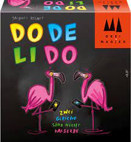
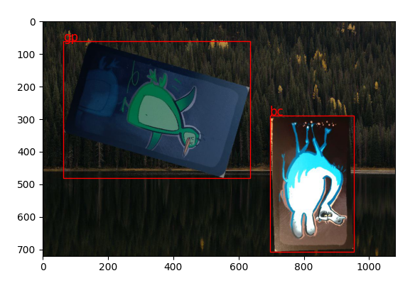

# Dodelido
DeepLearning Implementation of the card game Dodelido to play the game using DeepLearning techniques.  
Dodelido is a fast-paced and fun card game that can be played with 2 to 6 players. 
[Link to the description](https://de.wikipedia.org/wiki/Dodelido)


*Cover of the card game dodelido*

# Table of contents
- [The Game](#the-game)
- [Implementation details](#implementation)
- [Dataset](#dataset)


# The game
The aim of the game Dodelido is to get rid of one's own cards as quickly as possible and to react to one of one's own laid out cards each time and not to make any mistakes. The game material consists of 105 cards, each containing 20 times the animal cards Flamingo, Penguin, Turtle, Camel and Zebra, and 5 times the Crocodile.[1]
## How to play


At the beginning of the game, all cards are shuffled and evenly distributed to the players, any excess cards are removed from the game. 
The players each take their cards as a face-down pile in their hands, then the game is played in turns starting with the starting player (according to the game instructions, the youngest player).[1] The starting player places the top cards on the table.

The starting player quickly lays the top card of his draw pile face up on one of the three discard piles and directly makes a statement about the card. The discard piles are served clockwise in turn and the statement must always concern the feature that occurs most frequently in the three discards.

The following statements can be made in case of a match:

Colour: If at least two animals match in colour, the colour is announced.
Animal species: If at least two cards show the same animal species, the animal species is announced.
If there are matches for both the animal species and the colour, the feature that is present more often on the three cards counts. If both features are present the same number of times, the player says Dodelido![1].

If there are no matches in colour or animal type, the player says Nix!, this also applies in principle to the first card played. If the turtle is part of the match or the discard with no matches, the announcement is preceded by an ÖH to indicate the slowness of the animals. If a crocodile appears in the display, all players must hit the card (to drive away the evil animal); the player who reacted last and whose hand is correspondingly on top loses the round.[1]

Whenever a player makes a mistake or takes more than three seconds to make his announcement, he gets all the cards on display and must add them to his hand pile. This also applies to the player who was slowest to respond to the crocodile. After that, the player who had to take the cards starts the new draw.[1]

The winner of the game is the player who has played all the cards in his hand first. He ends the game with his last card.


# Implementation
For detecting destinct cards, the [yolo-v5 model](https://github.com/ultralytics/yolov5) was used.

# Dataset
For generating the dataset, all 25 distinct cards were photographed using a mobile phone. The cards were afterwards separated.
For generating the dataset for training, validation and test run the following code. 
Changes in parameters can be done by editing ```config.py```
```python
from src.data_gen import run_data_preparation
run_data_preparation()
```
As a result, a dataset with labels is generated. To avoid photographing and labelling, the images are composed of 1-3 randomly placed cards on a random background as shown in [Figure 1](#figure1)

!
*Figure 1: Random generated Dodelido-Cards on a random background. With artificially added labels gp (green penguin) and bc (blue camel)*


# Results
The following video demonstrates the model perfomance in recognizing the different animals:


https://github.com/schlafel/Dodelido/assets/68279686/43f50ccd-08f6-4d39-9dfb-9f3e01300712


# License

dodelido is licensed under the GNU GENERAL PUBLIC LICENSE. Feel free to use, modify, and distribute the code for your purposes. However, please attribute the original authors by linking back to this repository.

